gspatial\_plot package
======================
The examples mentioned in he documentation is also part of examples jupyter notebook present in the github repo, So feel free to download it and play with it.

.. py:function:: randommap(    data,    title=None,    title_kwds={},    figsize=(15, 15),    facecolor="white",    edgecolor="black",    linewidth=0.5,    seed=3,    annot=False,    annot_column=None,    annot_align="center",    annot_kwds={},    ax=None,    axis_on=False,    colors=colors,    **geopandas_plot_kwds,)
    
    Fills the data with random colors. Ideal for generating political maps.

    :param data: GeoDataFrame for which the map must be plotted
    :type data: GeoDataFrame
    :param title: Title of the map. Defaults to None.
    :type title: str
    :param title_kwds: Keyword arguments to matplotlib.pyplot.title. Defaults to {}.
    :type title_kwds: dict
    :param figsize: Figure size. Defaults to (15, 15).
    :type figsize: tuple
    :param facecolor: Figure's face color. Defaults to "white".
    :type facecolor: str
    :param edgecolor: Map's edge color. Defaults to "black".
    :type edgecolor: str
    :param linewidth: Width of lines for shapes. Defaults to 0.5.
    :type linewidth: float
    :param seed: Seed for generating random colors. Defaults to 3.
    :type seed: int
    :param annot: If True, annotations are generated. Defaults to False.
    :type annot: bool
    :param annot_column: If annot is True, column should b passed as source for annotation. Defaults to None.
    :type annot_column: str/GeoDataFrame column
    :param annot_align: Text alignment for annotation. Defaults to "center".
    :type annot_align: str
    :param annot_kwds: Keyword arguments for annotation. Defaults to {}.
    :type annot_kwds: dict
    :param ax: axis must be passed if plotting needs to be done on an existing axis. Defaults to None.
    :type ax: matplotlib axis
    :param axis_on: If True, axes will be visible. Defaults to False.
    :type axis_on: bool
    :param colors: List of colors to sample from. Defaults to a predefined set of colors.
    :type colors: list/tuple
    :param \*\*geopandas_plot_kwds: Geopandas plot keyword arguments
    :returns: matplotlib axis object
    :rtype: ax

**Examples**
::

    gsp.randommap(usa, seed=3, annot=True, annot_column="NAME", figsize=(30, 30))

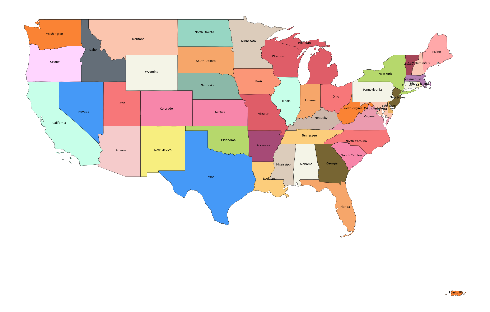

.. py:function:: shapeplot(    data,    title=None,    title_kwds={},    figsize=(15, 15),    facecolor="white",    edgecolor="grey",    linewidth=0.5,    color="#F1F3F4",    annot=False,    annot_column=None,    annot_align="center",    annot_kwds={},    ax=None,    axis_on=False,    **geopandas_plot_kwds,)
    
    Plots GeoDataFrame shapes. replacement for geopandas plot's default plot.

    :param data: GeoDataFrame for which the map must be plotted
    :type data: GeoDataFrame
    :param title: Title of the map. Defaults to None.
    :type title: str
    :param title_kwds: Keyword arguments to matplotlib.pyplot.title. Defaults to {}.
    :type title_kwds: dict
    :param figsize: Figure size. Defaults to (15, 15).
    :type figsize: tuple
    :param facecolor: Figure's face color. Defaults to "white".
    :type facecolor: str
    :param edgecolor: Map's edge color. Defaults to "black".
    :type edgecolor: str
    :param linewidth: Width of lines for shapes. Defaults to 0.5.
    :type linewidth: float
    :param color: Color of the shape. Defaults to "#F1F3F4".
    :type color: str
    :param annot: If True, annotations are generated. Defaults to False.
    :type annot: bool
    :param annot_column: If annot is True, column should b passed as source for annotation. Defaults to None.
    :type annot_column: str/GeoDataFrame column
    :param annot_align: Text alignment for annotation. Defaults to "center".
    :type annot_align: str
    :param annot_kwds: Keyword arguments for annotation. Defaults to {}.
    :type annot_kwds: dict
    :param ax: axis must be passed if plotting needs to be done on an existing axis. Defaults to None.
    :type ax: matplotlib axis
    :param axis_on: If True, axes will be visible. Defaults to False.
    :type axis_on: bool
    :param \*\*geopandas_plot_kwds: Geopandas plot keyword arguments
    :returns: matplotlib axis object
    :rtype: ax
    
**Examples**
::
    
    gsp.shapeplot(usa, figsize=(15, 15))

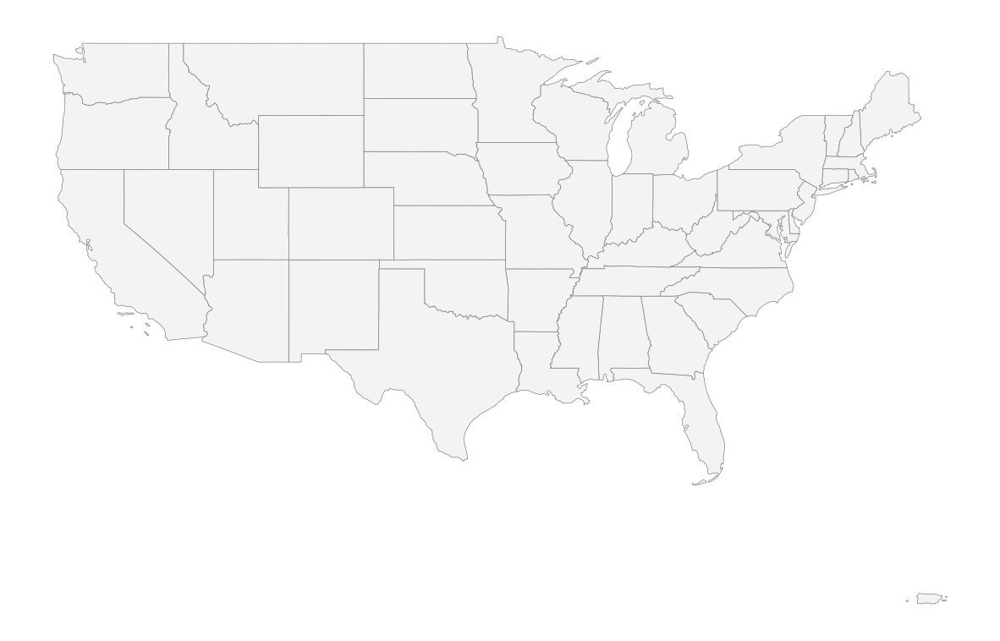

::
    
    gsp.shapeplot(
        usa,
        title="USA MAP",
        title_kwds={"fontsize": 25, "fontname": "sans-serif", "fontweight": 3},
    )

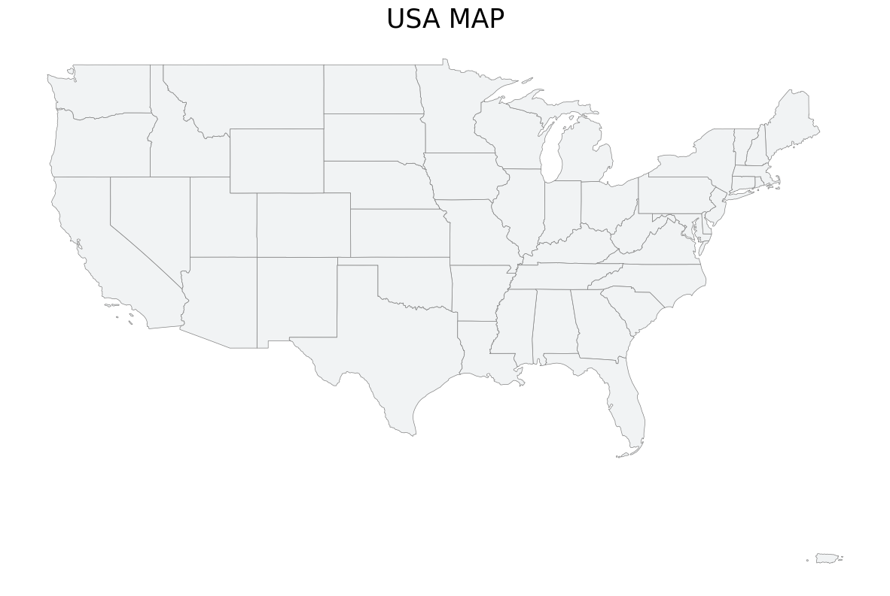

.. py:function:: pointplot(    data,    base=None,    title=None,    title_kwds={},    figsize=(15, 15),    color="#ffb536",    edgecolor="black",    basecolor="#F1F3F4",    baseboundarycolor="black",    base_boundary=True,    boundary_linewidth=0.5,    linewidth=0.5,    annot=False,    annot_column=None,    annot_align="center",    annot_kwds={},    ax=None,    axis_on=False,    facecolor="white",    **geopandas_plot_kwds,)
 
    Plots point data. Can plot it over another GeoDataFrame

    :param data: GeoDataFrame for which the map must be plotted
    :type data: GeoDataFrame
    :param base: Base GeoDataFrame on top of which data must be plotted. Defaults to None.
    :type base: GeoDataFrame
    :param title: Title of the map. Defaults to None.
    :type title: str
    :param title_kwds: Keyword arguments to matplotlib.pyplot.title. Defaults to {}.
    :type title_kwds: dict
    :param figsize: Figure size. Defaults to (15, 15).
    :type figsize: tuple
    :param color: Color of the point. Defaults to "#ffb536".
    :type color: str
    :param edgecolor: Map's edge color. Defaults to "black".
    :type edgecolor: str
    :param basecolor: Color of the base data. Defaults to "#F1F3F4".
    :type basecolor: str
    :param baseboundarycolor: Boundary color of the base data. Defaults to "black".
    :type baseboundarycolor: str
    :param base_boundary: If Base data boundaries should be visible. Defaults to True.
    :type base_boundary: bool
    :param boundary_linewidth: Linewidth of the base data boundaries. Defaults to 0.5.
    :type boundary_linewidth: float
    :param linewidth: Width of lines for shapes. Defaults to 0.5.
    :type linewidth: float
    :param annot: If True, annotations are generated. Defaults to False.
    :type annot: bool
    :param annot_column: If annot is True, column should b passed as source for annotation. Defaults to None.
    :type annot_column: str/GeoDataFrame column
    :param annot_align: Text alignment for annotation. Defaults to "center".
    :type annot_align: str
    :param annot_kwds: Keyword arguments for annotation. Defaults to {}.
    :type annot_kwds: dict
    :param ax: axis must be passed if plotting needs to be done on an existing axis. Defaults to None.
    :type ax: matplotlib axis
    :param axis_on: If True, axes will be visible. Defaults to False.
    :type axis_on: bool
    :param facecolor: Figure's face color. Defaults to "white".
    :type facecolor: str
    :param \*\*geopandas_plot_kwds: Geopandas plot keyword arguments 
    :returns: matplotlib axis object
    :rtype: ax

**Examples**
::
    
    gsp.pointplot(usa_points, base=usa)

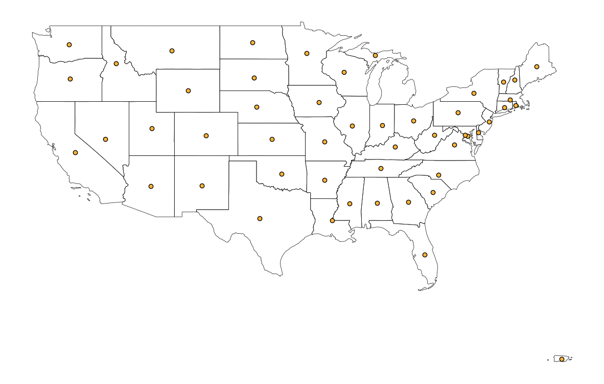

::
    
    gsp.pointplot(usa_points, base=usa, base_boundary=False)

.. image:: images/pointplot2.png
   :width: 600

::
    
    gsp.pointplot(usa_points)

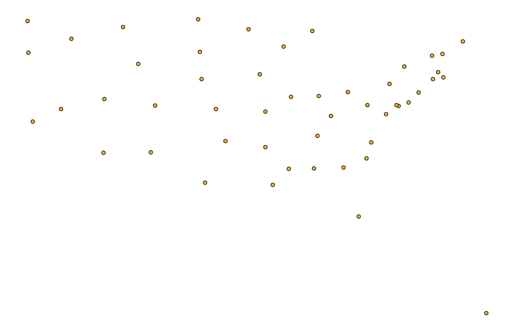

::
    
    ax = gsp.shapeplot(usa, figsize=(15, 15))
    gsp.pointplot(usa_points, ax=ax)

.. image:: images/pointplot4.png
   :width: 600

::
    
    gsp.pointplot(
        usa_points,
        base=usa,
        basecolor="#7aebff",
        base_boundary=False,
        title="USA Points",
        title_kwds={"fontsize": 25, "fontname": "sans-serif", "fontweight": 3},
    )

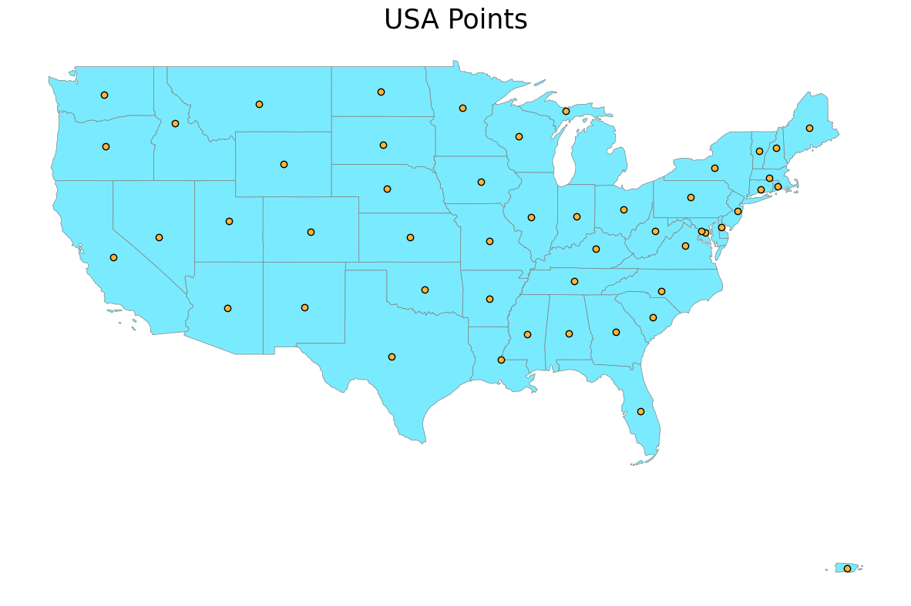

.. py:function:: choropleth(    data,    column,    title=None,    title_kwds={},    figsize=(15, 15),    cmap="YlOrRd",    facecolor="white",    scheme="percentiles",    boundarycolor="black",    boundary_linewidth=0.5,    scale_colorbar=False,    legend=True,    annot=False,    annot_column=None,    annot_align="center",    annot_kwds={},    ax=None,    axis_on=False,    **geopandas_plot_kwds,)
 
    Generates Choropleth Map. Replacement for geopandas plot with a column passed in arguments.

    :param data: GeoDataFrame for which the map must be plotted
    :type data: GeoDataFrame
    :param column: Column for which choropleth map should be plotted
    :type column: str/GeoDataFrame column
    :param title: Title of the map. Defaults to None.
    :type title: str
    :param title_kwds: Keyword arguments to matplotlib.pyplot.title. Defaults to {}.
    :type title_kwds: dict
    :param figsize: Figure size. Defaults to (15, 15).
    :type figsize: tuple
    :param cmap: Colormap for the plot. Defaults to "YlOrRd".
    :type cmap: str
    :param facecolor: Figure's face color. Defaults to "white".
    :type facecolor: str
    :param scheme: mapclassify scheme for assigning colors. Defaults to "percentiles".
    :type scheme: str
    :param boundarycolor: Map's boundary color. Defaults to "black".
    :type boundarycolor: str
    :param boundary_linewidth: Linewidth of boundaries. Defaults to 0.5.
    :type boundary_linewidth: float
    :param scale_colorbar: If True, the colorbar is scaled to the map extents. Defaults to False.
    :type scale_colorbar: bool
    :param legend: If True, legend is displayed. Defaults to True.
    :type legend: bool
    :param annot: If True, annotations are generated. Defaults to False.
    :type annot: bool
    :param annot_column: If annot is True, column should b passed as source for annotation. Defaults to None.
    :type annot_column: str/GeoDataFrame column
    :param annot_align: Text alignment for annotation. Defaults to "center".
    :type annot_align: str
    :param annot_kwds: Keyword arguments for annotation. Defaults to {}.
    :type annot_kwds: dict
    :param ax: axis must be passed if plotting needs to be done on an existing axis. Defaults to None.
    :type ax: matplotlib axis
    :param axis_on: If True, axes will be visible. Defaults to False.
    :type axis_on: bool
    :param \*\*geopandas_plot_kwds: Geopandas plot keyword arguments
    :returns: matplotlib axis object
    :rtype: ax

**Examples**
::
    
    gsp.choropleth(usa, "AWATER")

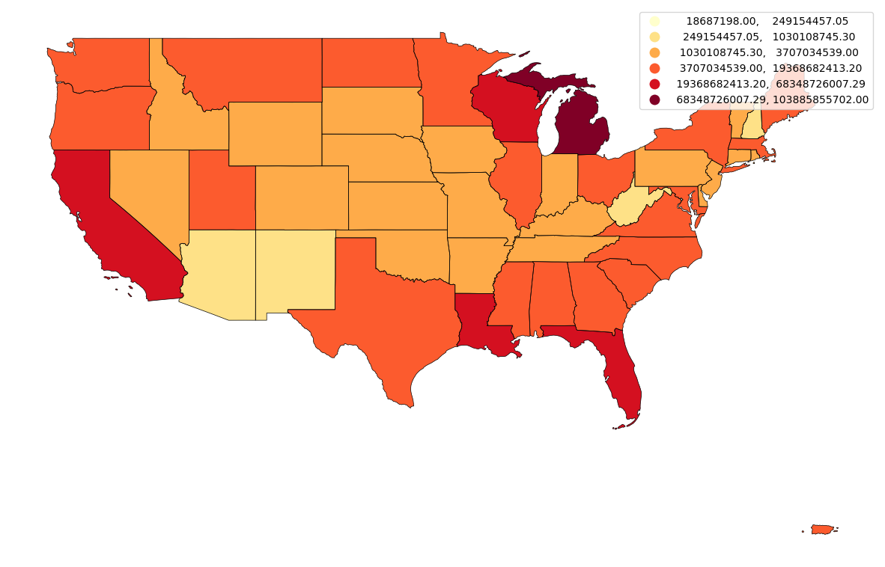

::
    
    gsp.choropleth(
        usa,
        "AWATER",
        scheme=None,
        scale_colorbar=True,
    )

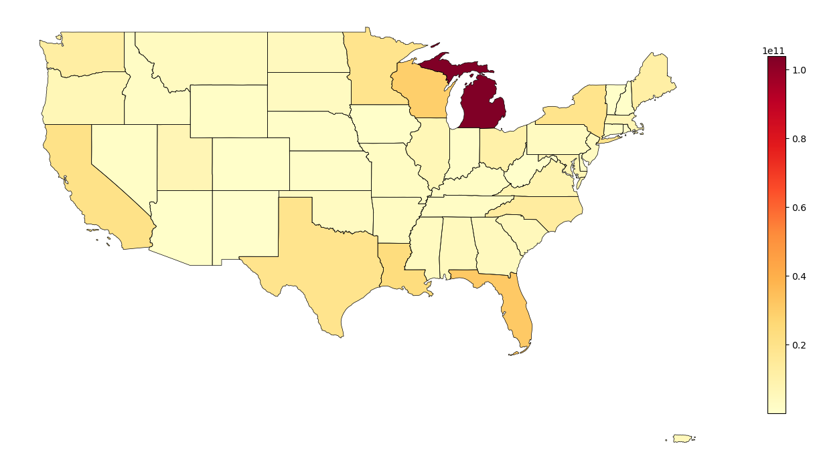

::
    
    gsp.choropleth(
        usa,
        "AWATER",
        cmap="Blues",
        figsize=(30, 30),
        legend_kwds={"loc": "lower left", "bbox_to_anchor": (0, 0.2), "prop": {"size": 22}},
        title="USA TOTAL WATER AREA",
        title_kwds={
            "fontsize": 50,
            "fontname": "sans-serif",
            "fontweight": 3,
            "loc": "right",
        },
    )

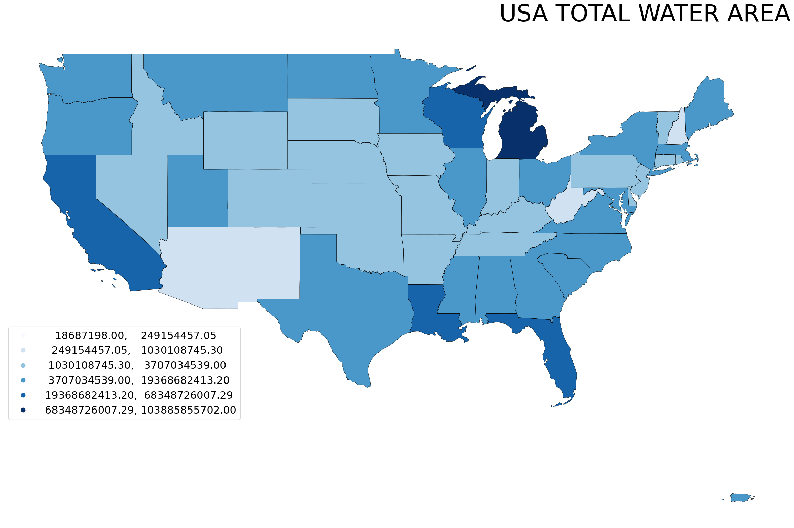

.. py:function:: bubblemap(    data,    column,    base=None,    basecolor="#F1F3F4",    baseboundarycolor="black",    base_boundary=True,    point_data=False,    scale_factor=200,    title=None,    title_kwds={},    figsize=(15, 15),    linewidth=0.5,    cmap="YlOrRd",    edgecolor="black",    facecolor="white",    scheme="percentiles",    boundarycolor="black",    boundary_linewidth=0.5,    scale_colorbar=False,    legend=True,    annot=False,    annot_column=None,    annot_align="center",    annot_kwds={},    ax=None,    axis_on=False,    **geopandas_plot_kwds,)
    
    Plots a bubble map.

    :param data: GeoDataFrame for which the map must be plotted
    :type data: GeoDataFrame
    :param column: Column for which the plot should be plotted
    :type column: str/GeoDataFrame column
    :param base: Base GeoDataFrame on top of which data must be plotted. Defaults to None.
    :type base: GeoDataFrame
    :param basecolor: Color of the base data. Defaults to "#F1F3F4".
    :type basecolor: str
    :param baseboundarycolor: Boundary color of the base data. Defaults to "black".
    :type baseboundarycolor: str
    :param base_boundary: If Base data boundaries should be visible. Defaults to True.
    :type base_boundary: bool
    :param point_data: Must be true if the type of data being mapped is point shape. Defaults to False.
    :type point_data: bool
    :param scale_factor: Scales the bubbles, higher scale factor means larger the bubble. Defaults to 200.
    :type scale_factor: int
    :param title: Title of the map. Defaults to None.
    :type title: str
    :param title_kwds: Keyword arguments to matplotlib.pyplot.title. Defaults to {}.
    :type title_kwds: dict
    :param figsize: Figure size. Defaults to (15, 15).
    :type figsize: tuple
    :param linewidth: Width of lines for shapes. Defaults to 0.5.
    :type linewidth: float
    :param cmap: Colormap for the plot. Defaults to "YlOrRd".
    :type cmap: str
    :param edgecolor: Map's edge color. Defaults to "black".
    :type edgecolor: str
    :param facecolor: Figure's face color. Defaults to "white".
    :type facecolor: str
    :param scheme: mapclassify scheme for assigning colors. Defaults to "percentiles".
    :type scheme: str
    :param boundarycolor: Map's boundary color. Defaults to "black".
    :type boundarycolor: str
    :param boundary_linewidth: Linewidth of boundaries. Defaults to 0.5.
    :type boundary_linewidth: float
    :param scale_colorbar: If True, the colorbar is scaled to the map extents. Defaults to False.
    :type scale_colorbar: bool
    :param legend: If True, legend is displayed. Defaults to True.
    :type legend: bool
    :param annot: If True, annotations are generated. Defaults to False.
    :type annot: bool
    :param annot_column: If annot is True, column should b passed as source for annotation. Defaults to None.
    :type annot_column: str/GeoDataFrame column
    :param annot_align: Text alignment for annotation. Defaults to "center".
    :type annot_align: str
    :param annot_kwds: Keyword arguments for annotation. Defaults to {}.
    :type annot_kwds: dict
    :param ax: axis must be passed if plotting needs to be done on an existing axis. Defaults to None.
    :type ax: matplotlib axis
    :param axis_on: If True, axes will be visible. Defaults to False.
    :type axis_on: bool
    :param \*\*geopandas_plot_kwds: Geopandas plot keyword arguments
    :returns: matplotlib axis object
    :rtype: ax
    

**Examples**
::
    
    gsp.bubblemap(usa, usa["AWATER"])

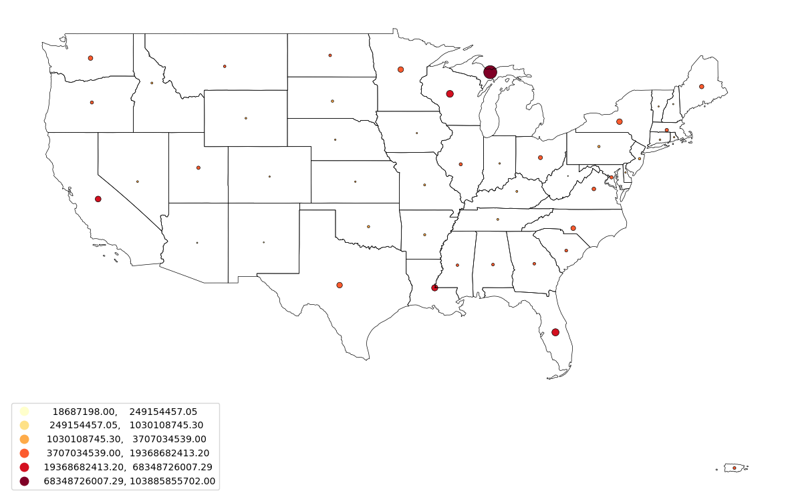

::
    
    gsp.bubblemap(usa, usa["AWATER"], scale_factor=400)

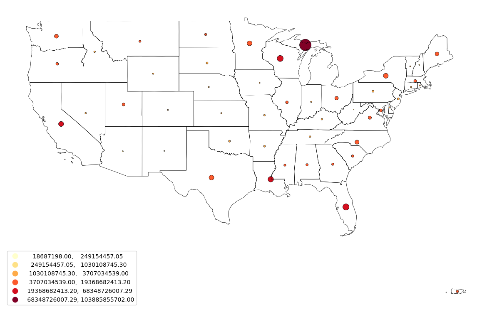

::
    
    gsp.bubblemap(usa_pts, "AWATER", point_data=True)

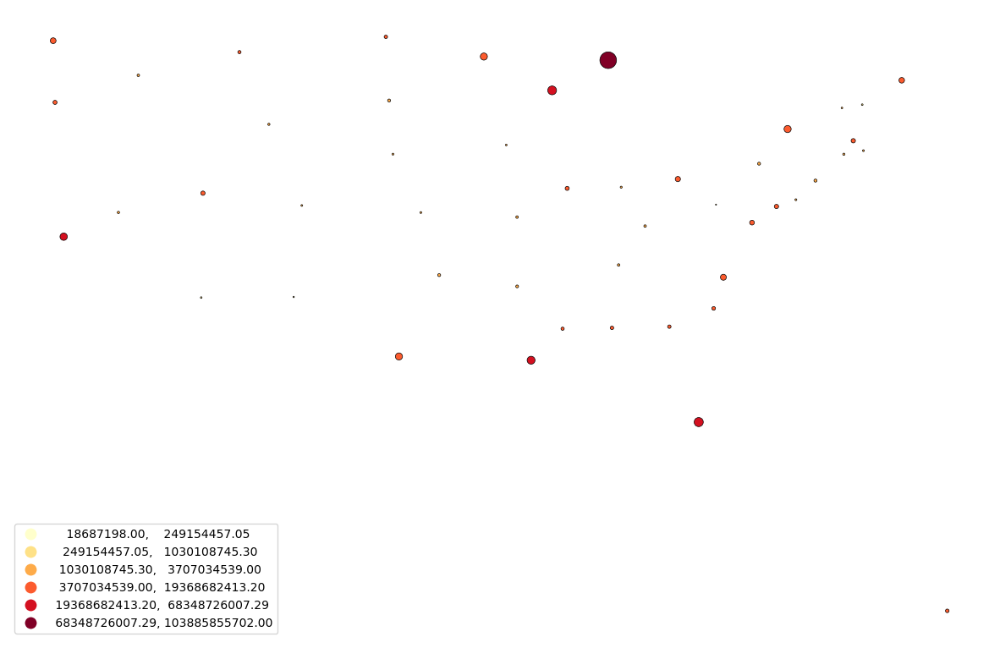

::
    
    gsp.bubblemap(usa_pts, "AWATER", base=usa, base_boundary=False, point_data=True)

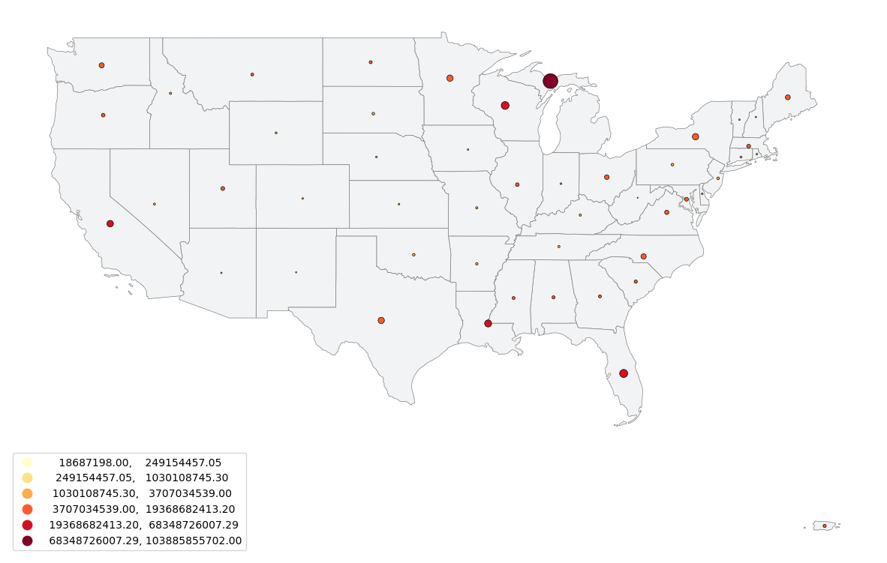

::
    
    gsp.bubblemap(
        usa,
        usa["AWATER"],
        cmap="Blues",
        figsize=(30, 30),
        legend_kwds={"loc": "lower left", "bbox_to_anchor": (0, 0.2), "prop": {"size": 22}},
        title="USA TOTAL WATER AREA",
        title_kwds={
            "fontsize": 50,
            "fontname": "sans-serif",
            "fontweight": 3,
            "loc": "right",
        },
        scale_factor=2000,
    )

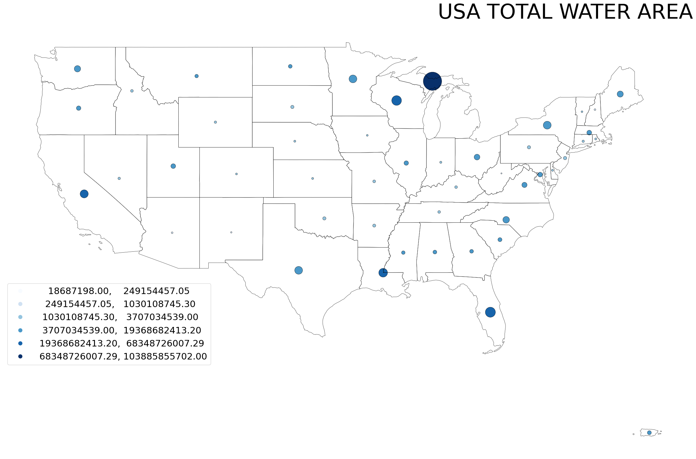

.. py:function:: cartogram(    data,    column,    basecolor="#F1F3F4",    base_boundary=True,    cartogram_only=False,    title=None,    title_kwds={},    figsize=(15, 15),    linewidth=0.5,    cmap="YlOrRd",    edgecolor="black",    facecolor="white",    scheme="percentiles",    boundarycolor="black",    boundary_linewidth=0.5,    scale_colorbar=False,    legend=True,    annot=False,    annot_column=None,    annot_align="center",    annot_kwds={},    ax=None,    axis_on=False,    **geopandas_plot_kwds,)
 
    Plots a cartogram

    :param data: GeoDataFrame for which the map must be plotted
    :type data: GeoDataFrame
    :param column: Column for which the plot should be plotted
    :type column: str/GeoDataFrame column
    :param basecolor: Color of the base data. Defaults to "#F1F3F4".
    :type basecolor: str
    :param base_boundary: If Base data boundaries should be visible. Defaults to True.
    :type base_boundary: bool
    :param cartogram_only: If True, function returns cartogram without base data. Defaults to False.
    :type cartogram_only: bool
    :param title: Title of the map. Defaults to None.
    :type title: str
    :param title_kwds: Keyword arguments to matplotlib.pyplot.title. Defaults to {}.
    :type title_kwds: dict
    :param figsize: Figure size. Defaults to (15, 15).
    :type figsize: tuple
    :param linewidth: Width of lines for shapes. Defaults to 0.5.
    :type linewidth: float
    :param cmap: Colormap for the plot. Defaults to "YlOrRd".
    :type cmap: str
    :param edgecolor: Map's edge color. Defaults to "black".
    :type edgecolor: str
    :param facecolor: Figure's face color. Defaults to "white".
    :type facecolor: str
    :param scheme: mapclassify scheme for assigning colors. Defaults to "percentiles".
    :type scheme: str
    :param boundarycolor: Map's boundary color. Defaults to "black".
    :type boundarycolor: str
    :param boundary_linewidth: Linewidth of boundaries. Defaults to 0.5.
    :type boundary_linewidth: float
    :param scale_colorbar: If True, the colorbar is scaled to the map extents. Defaults to False.
    :type scale_colorbar: bool
    :param legend: If True, legend is displayed. Defaults to True.
    :type legend: bool
    :param annot: If True, annotations are generated. Defaults to False.
    :type annot: bool
    :param annot_column: If annot is True, column should b passed as source for annotation. Defaults to None.
    :type annot_column: str/GeoDataFrame column
    :param annot_align: Text alignment for annotation. Defaults to "center".
    :type annot_align: str
    :param annot_kwds: Keyword arguments for annotation. Defaults to {}.
    :type annot_kwds: dict
    :param ax: axis must be passed if plotting needs to be done on an existing axis. Defaults to None.
    :type ax: matplotlib axis
    :param axis_on: If True, axes will be visible. Defaults to False.
    :type axis_on: bool
    :param \*\*geopandas_plot_kwds: Geopandas plot keyword arguments
    :returns: matplotlib axis object
    :rtype: ax

**Examples**
::
    
    gsp.cartogram(usa,"AWATER")

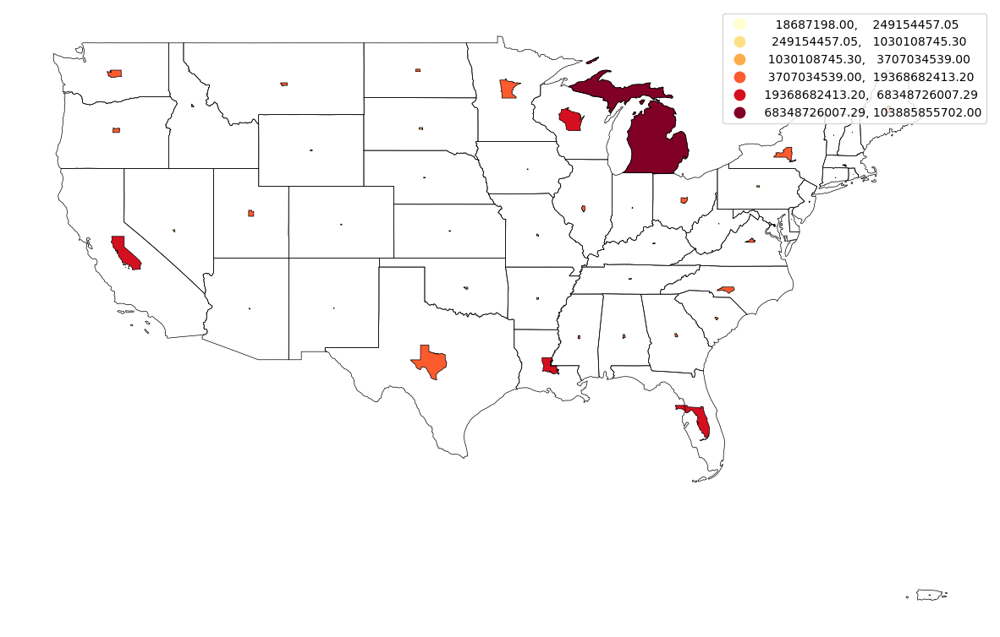

::
    
    gsp.cartogram(
        usa,
        usa["AWATER"],
        cmap="Blues",
        figsize=(30, 30),
        legend_kwds={"loc": "lower left", "bbox_to_anchor": (0, 0.2), "prop": {"size": 22}},
        title="USA TOTAL WATER AREA",
        title_kwds={
            "fontsize": 50,
            "fontname": "sans-serif",
            "fontweight": 3,
            "loc": "right",
        },
    )

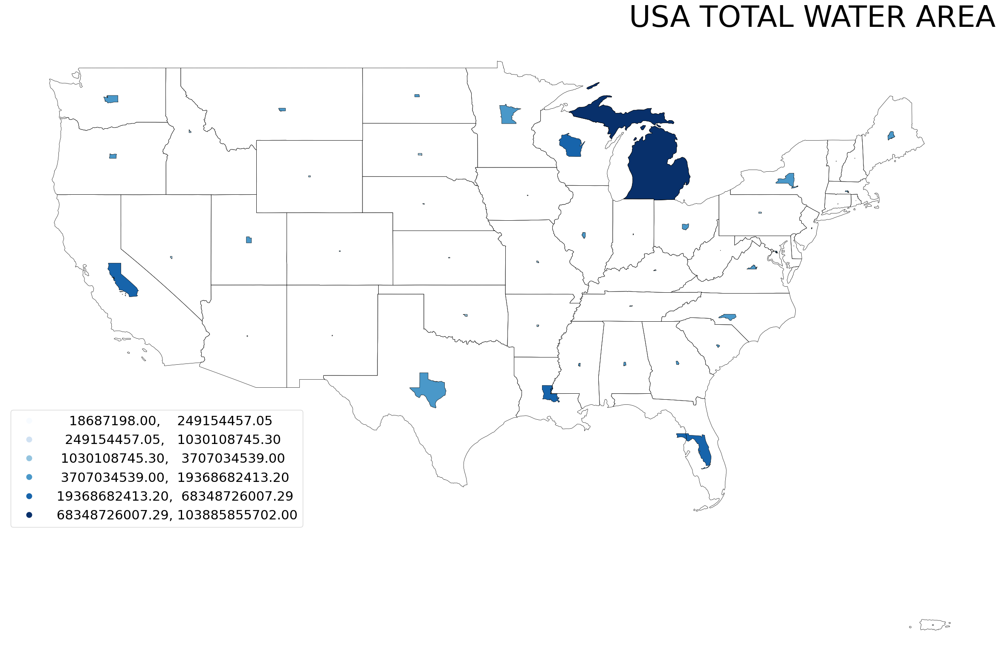

::
    
    gsp.cartogram(
        usa,
        usa["AWATER"],
        cartogram_only=True,
        cmap="Blues",
        figsize=(30, 30),
        legend_kwds={"loc": "lower left", "bbox_to_anchor": (0, 0.2), "prop": {"size": 22}},
        title="USA TOTAL WATER AREA",
        title_kwds={
            "fontsize": 50,
            "fontname": "sans-serif",
            "fontweight": 3,
            "loc": "right",
        },
    )

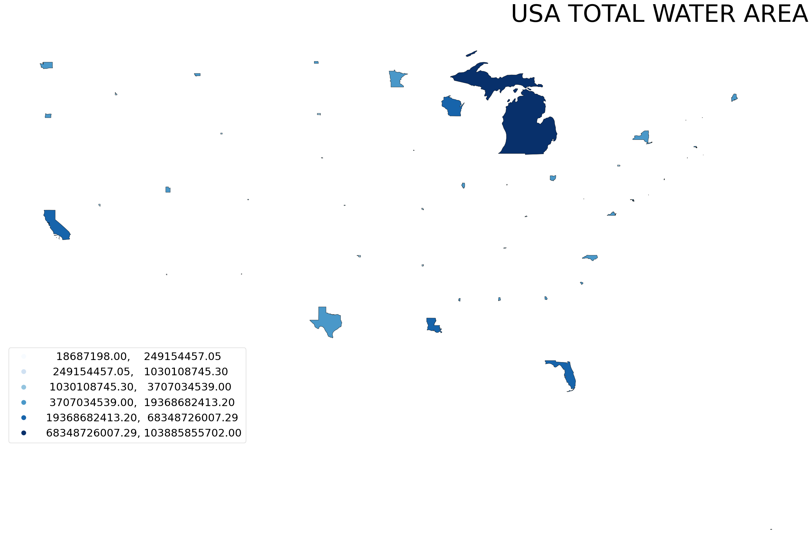

.. py:function:: densityplot(    data,    base=None,    clip=False,    clip_factor=1.2,    point_data=False,    title=None,    title_kwds={},    figsize=(15, 15),    cmap="YlOrRd",    facecolor="white",    boundarycolor="black",    boundary_linewidth=0.5,    scale_colorbar=False,    ax=None,    axis_on=False,    **geopandas_plot_kwds,)
    
    Plots a kde plot over a GeoDataFrame

    :param data: GeoDataFrame for which the map must be plotted
    :type data: GeoDataFrame
    :param base: Base GeoDataFrame on top of which data must be plotted. Defaults to None.
    :type base: GeoDataFrame
    :param clip: If True, the plot is clipped to geo data boundary. Defaults to False.
    :type clip: bool
    :param clip_factor: Controls the scale of clipping mask, increase this if the plot is outside clipping boundary. Defaults to 1.2.
    :type clip_factor: float
    :param point_data: Must be true if the type of data being mapped is point shape. Defaults to False.
    :type point_data: bool
    :param title: Title of the map. Defaults to None.
    :type title: str
    :param title_kwds: Keyword arguments to matplotlib.pyplot.title. Defaults to {}.
    :type title_kwds: dict
    :param figsize: Figure size. Defaults to (15, 15).
    :type figsize: tuple
    :param cmap: Colormap for the plot. Defaults to "YlOrRd".
    :type cmap: str
    :param boundarycolor: Map's boundary color. Defaults to "black".
    :type boundarycolor: str
    :param boundary_linewidth: Linewidth of boundaries. Defaults to 0.5.
    :type boundary_linewidth: float
    :param scale_colorbar: If True, the colorbar is scaled to the map extents. Defaults to False.
    :type scale_colorbar: bool
    :param ax: axis must be passed if plotting needs to be done on an existing axis. Defaults to None.
    :type ax: matplotlib axis
    :param axis_on: If True, axes will be visible. Defaults to False.
    :type axis_on: bool
    :param \*\*geopandas_plot_kwds: Geopandas plot keyword arguments
    :param facecolor:  (Default value = "white")
    :returns: matplotlib axis object
    :rtype: ax

**Examples**
::
    
    gsp.densityplot(usa)

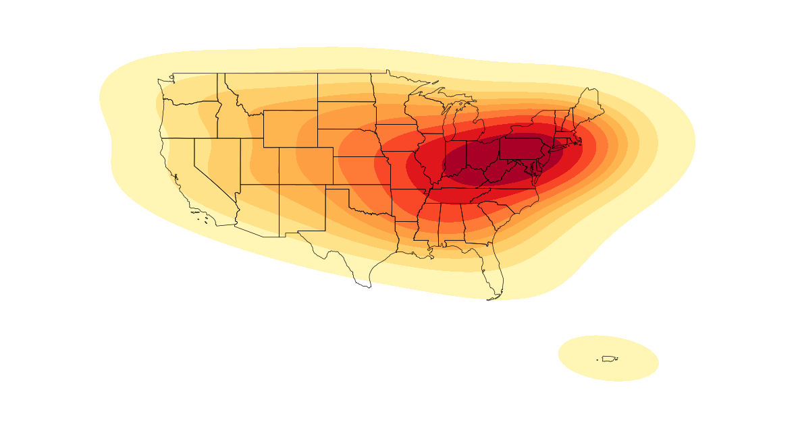

::
    
    gsp.densityplot(usa, clip=True, clip_factor=1.5)

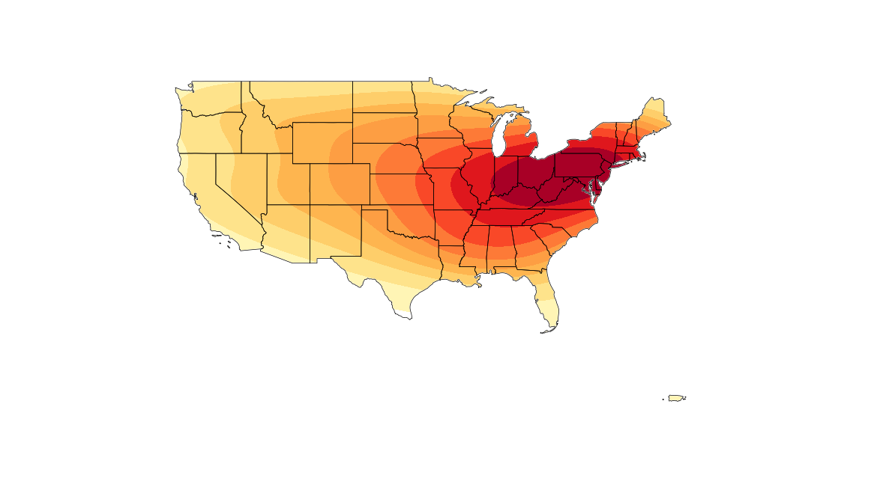

.. py:function:: heatmap(    data,    column,    base=None,    point_data=False,    interpolate=False,    interpolation_grid_space=0.05,    clip=False,    clip_factor=1.2,    title=None,    title_kwds={},    figsize=(15, 15),    cmap="YlOrRd",    facecolor="white",    scheme="percentiles",    boundarycolor="black",    boundary_linewidth=0.5,    scale_colorbar=False,    legend=True,    ax=None,    annot=False,    annot_column=None,    annot_align="center",    annot_kwds={},    axis_on=False,    **geopandas_plot_kwds,)

    Plots heatmap. For polygons, the function returns a Choropleth map by default unless interpolated.

    :param data: GeoDataFrame for which the map must be plotted
    :type data: GeoDataFrame
    :param column: Column for which the plot should be plotted
    :type column: str/GeoDataFrame column
    :param base: Base GeoDataFrame on top of which data must be plotted. Defaults to None.
    :type base: GeoDataFrame
    :param point_data: Must be true if the type of data being mapped is point shape. Defaults to False.
    :type point_data: bool
    :param interpolate: If True, data is interpolated using KNN. Defaults to False.
    :type interpolate: bool
    :param interpolation_grid_space: Grid Space for interpolation, Higher grid space needs more time and memory for interpolation. Defaults to 0.05.
    :type interpolation_grid_space: float
    :param clip: If True, the plot is clipped to geo data boundary. Defaults to False.
    :type clip: bool
    :param clip_factor: Controls the scale of clipping mask, increase this if the plot is outside clipping boundary. Defaults to 1.2.
    :type clip_factor: float
    :param title: Title of the map. Defaults to None.
    :type title: str
    :param title_kwds: Keyword arguments to matplotlib.pyplot.title. Defaults to {}.
    :type title_kwds: dict
    :param figsize: Figure size. Defaults to (15, 15).
    :type figsize: tuple
    :param cmap: Colormap for the plot. Defaults to "YlOrRd".
    :type cmap: str
    :param facecolor: Figure's face color. Defaults to "white".
    :type facecolor: str
    :param scheme: mapclassify scheme for assigning colors. Defaults to "percentiles".
    :type scheme: str
    :param boundarycolor: Map's boundary color. Defaults to "black".
    :type boundarycolor: str
    :param boundary_linewidth: Linewidth of boundaries. Defaults to 0.5.
    :type boundary_linewidth: float
    :param scale_colorbar: If True, the colorbar is scaled to the map extents. Defaults to False.
    :type scale_colorbar: bool
    :param legend: If True, legend is displayed. Defaults to True.
    :type legend: bool
    :param annot: If True, annotations are generated. Defaults to False.
    :type annot: bool
    :param annot_column: If annot is True, column should b passed as source for annotation. Defaults to None.
    :type annot_column: str/GeoDataFrame column
    :param annot_align: Text alignment for annotation. Defaults to "center".
    :type annot_align: str
    :param annot_kwds: Keyword arguments for annotation. Defaults to {}.
    :type annot_kwds: dict
    :param ax: axis must be passed if plotting needs to be done on an existing axis. Defaults to None.
    :type ax: matplotlib axis
    :param axis_on: If True, axes will be visible. Defaults to False.
    :type axis_on: bool
    :param \*\*geopandas_plot_kwds: Geopandas plot keyword arguments
    :returns: matplotlib axis object
    :rtype: ax

**Examples**

::
    
    gsp.heatmap(usa, "AWATER")

.. image:: images/heatmap1.png
   :width: 600

::
    
    gsp.heatmap(
        usa,
        "AWATER",
        interpolate=True,
        interpolation_grid_space=0.1,
        clip=True,
    )

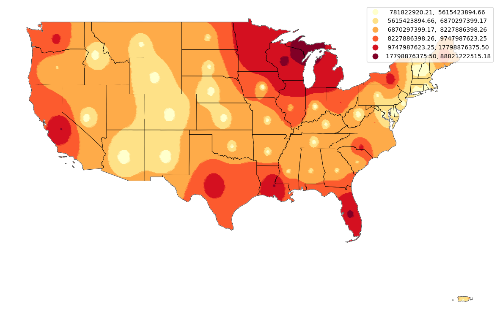

.. py:function:: spikemap(    data,    column,    shape="triangle",    spike_only=False,    base=None,    basecolor="#F1F3F4",    baseboundarycolor="black",    base_boundary=True,    point_data=False,    not_wgs84=False,    x_scale_factor=10,    y_scale_factor=10,    title=None,    title_kwds={},    figsize=(15, 15),    linewidth=0.5,    cmap="YlOrRd",    edgecolor=None,    facecolor="white",    scheme="percentiles",    boundarycolor="black",    boundary_linewidth=0.5,    scale_colorbar=False,    legend=True,    annot=False,    annot_column=None,    annot_align="center",    annot_kwds={},    ax=None,    axis_on=False,    **geopandas_plot_kwds,)
    
    Generates a spikemap.

    :param data: GeoDataFrame for which the map must be plotted
    :type data: GeoDataFrame
    :param column: Column for which the plot should be plotted
    :type column: str/GeoDataFrame column
    :param shape: Shape of spike, either rectangle or triangle. Defaults to "triangle".
    :type shape: str
    :param spike_only: If True, only spikes are returned without base map. Defaults to False.
    :type spike_only: bool
    :param base: Base GeoDataFrame on top of which data must be plotted. Defaults to None.
    :type base: GeoDataFrame
    :param basecolor: Color of the base data. Defaults to "#F1F3F4".
    :type basecolor: str
    :param baseboundarycolor: Boundary color of the base data. Defaults to "black".
    :type baseboundarycolor: str
    :param base_boundary: If Base data boundaries should be visible. Defaults to True.
    :type base_boundary: bool
    :param point_data: Must be true if the type of data being mapped is point shape. Defaults to False.
    :type point_data: bool
    :param not_wgs84: Needs to be true if data being plotted is not in WGS84/ESPG:4326. Defaults to False.
    :type not_wgs84: bool
    :param x_scale_factor: Scale factor for base of the shape. Defaults to 10.
    :type x_scale_factor: int
    :param y_scale_factor: Scale factor for height of the shape. Defaults to 10.
    :type y_scale_factor: int
    :param title: Title of the map. Defaults to None.
    :type title: str
    :param title_kwds: Keyword arguments to matplotlib.pyplot.title. Defaults to {}.
    :type title_kwds: dict
    :param figsize: Figure size. Defaults to (15, 15).
    :type figsize: tuple
    :param linewidth: Width of lines for shapes. Defaults to 0.5.
    :type linewidth: float
    :param cmap: Colormap for the plot. Defaults to "YlOrRd".
    :type cmap: str
    :param edgecolor: Map's edge color. Defaults to "black".
    :type edgecolor: str
    :param facecolor: Figure's face color. Defaults to "white".
    :type facecolor: str
    :param scheme: mapclassify scheme for assigning colors. Defaults to "percentiles".
    :type scheme: str
    :param boundarycolor: Map's boundary color. Defaults to "black".
    :type boundarycolor: str
    :param boundary_linewidth: Linewidth of boundaries. Defaults to 0.5.
    :type boundary_linewidth: float
    :param scale_colorbar: If True, the colorbar is scaled to the map extents. Defaults to False.
    :type scale_colorbar: bool
    :param legend: If True, legend is displayed. Defaults to True.
    :type legend: bool
    :param annot: If True, annotations are generated. Defaults to False.
    :type annot: bool
    :param annot_column: If annot is True, column should b passed as source for annotation. Defaults to None.
    :type annot_column: str/GeoDataFrame column
    :param annot_align: Text alignment for annotation. Defaults to "center".
    :type annot_align: str
    :param annot_kwds: Keyword arguments for annotation. Defaults to {}.
    :type annot_kwds: dict
    :param ax: axis must be passed if plotting needs to be done on an existing axis. Defaults to None.
    :type ax: matplotlib axis
    :param axis_on: If True, axes will be visible. Defaults to False.
    :type axis_on: bool
    :param \*\*geopandas_plot_kwds: Geopandas plot keyword arguments
    :returns: matplotlib axis object
    :rtype: ax

**Examples**
::
    
    gsp.spikemap(usa, "AWATER")

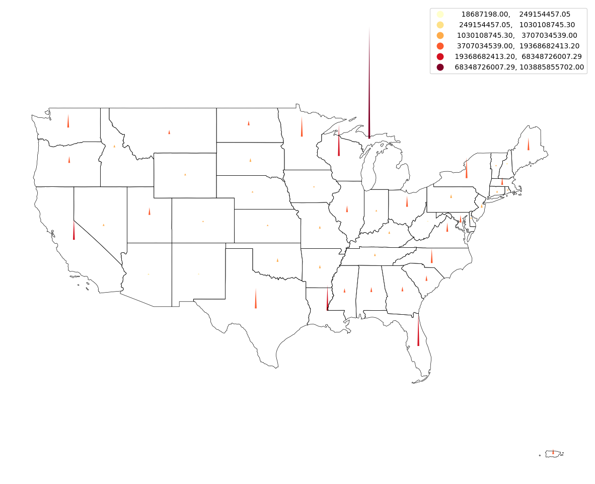

::
    
    usa_moll = usa.to_crs("ESRI:54009")
    gsp.spikemap(usa_moll, "AWATER", x_scale_factor=10, y_scale_factor=10, not_wgs84=True)

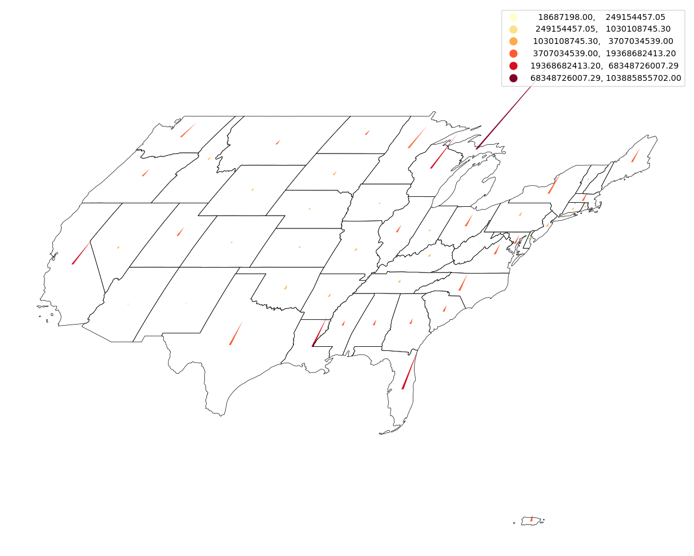

::
    
    gsp.spikemap(usa, "AWATER", spike_only=True)

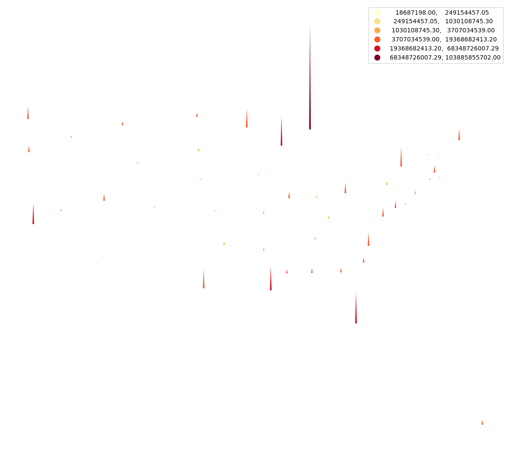

::
    
    gsp.spikemap(
        usa,
        usa["AWATER"],
        cmap="Blues",
        figsize=(30, 30),
        legend_kwds={"loc": "lower left", "bbox_to_anchor": (0, 0.2), "prop": {"size": 22}},
        title="USA TOTAL WATER AREA",
        title_kwds={
            "fontsize": 50,
            "fontname": "sans-serif",
            "fontweight": 3,
            "loc": "right",
        },
    )

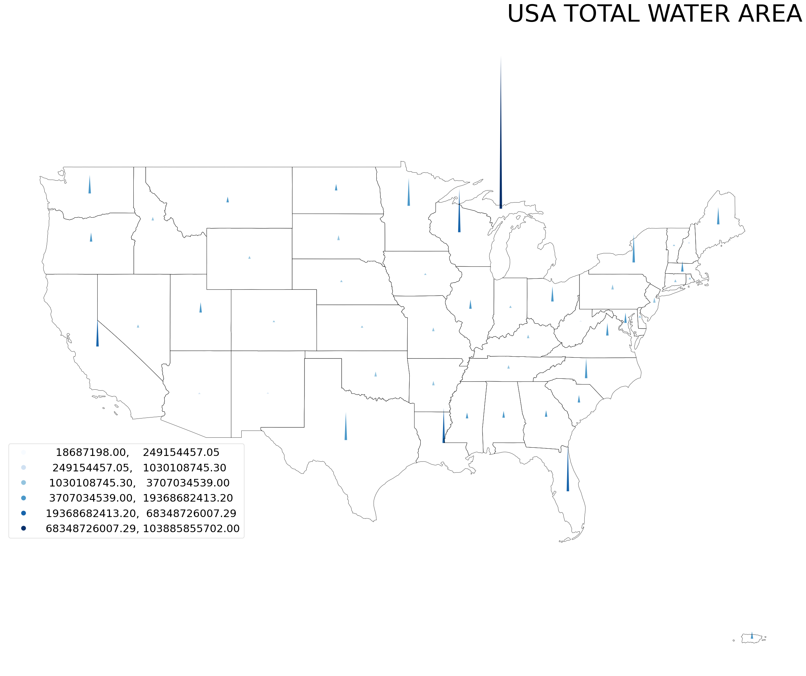

::
    
    gsp.spikemap(
        usa,
        usa["AWATER"],
        shape="rectangle",
        cmap="Blues",
        figsize=(30, 30),
        legend_kwds={"loc": "lower left", "bbox_to_anchor": (0, 0.2), "prop": {"size": 22}},
        title="USA TOTAL WATER AREA",
        title_kwds={
            "fontsize": 50,
            "fontname": "sans-serif",
            "fontweight": 3,
            "loc": "right",
        },
    )

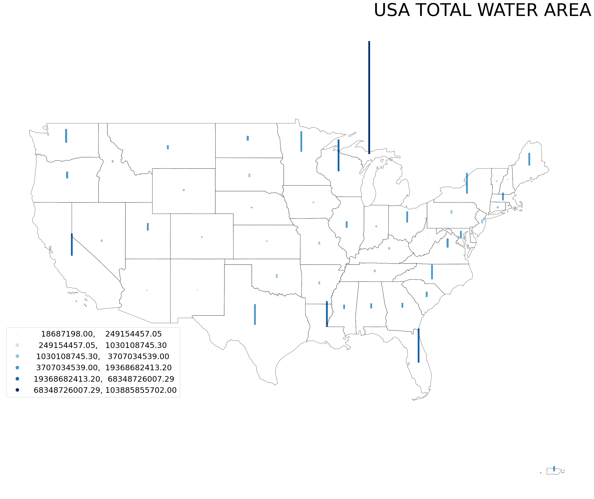

.. py:function:: offline_static_basemap(    bounds=None,    landcolor="#f1e9d7",    watercolor="#7ae2ff",    gridlinescolor="grey",    gridlines_alpha=0.5,    gridlines_width=0.5,    figsize=(15, 15),    title=None,    title_kwds={},    facecolor="white",    edgecolor="black",    edgewidth=0,    linewidth=0,    ax=None,    axis_on=False,    **geopandas_plot_kwds,)
 
    Generates a static basemap that can be used as base for other plots.
    This function can be used without internet as the map is generated using naturalearth vector data.

    :param bounds: Bounding box for clipping the basemap. Defaults to None.
    :type bounds: list/Geopandas Bounds
    :param landcolor: Color of land. Defaults to "#f1e9d7".
    :type landcolor: str
    :param watercolor: Color of water. Defaults to "#7ae2ff".
    :type watercolor: str
    :param gridlinescolor: Color of gridlines. Defaults to "grey".
    :type gridlinescolor: str
    :param gridlines_alpha: Opacity of gridlines. Defaults to 0.5.
    :type gridlines_alpha: float
    :param gridlines_width: Linewidth of gridlines. Defaults to 0.5.
    :type gridlines_width: float
    :param figsize: Figure size. Defaults to (15, 15).
    :type figsize: tuple
    :param title: Title of the map. Defaults to None.
    :type title: str
    :param title_kwds: Keyword arguments to matplotlib.pyplot.title. Defaults to {}.
    :type title_kwds: dict
    :param facecolor: Figure's face color. Defaults to "white".
    :type facecolor: str
    :param edgecolor: Map's edge color. Defaults to "black".
    :type edgecolor: str
    :param edgewidth: Width of edges. Defaults to 0.
    :type edgewidth: int
    :param linewidth: Width of boundaries. Defaults to 0.
    :type linewidth: int
    :param ax: axis must be passed if plotting needs to be done on an existing axis. Defaults to None.
    :type ax: matplotlib axis
    :param axis_on: If True, axes will be visible. Defaults to False.
    :type axis_on: bool
    :param \*\*geopandas_plot_kwds: Geopandas plot keyword arguments
    :returns: matplotlib axis object
    :rtype: ax
    
**Examples**
::
    
    gsp.offline_static_basemap()

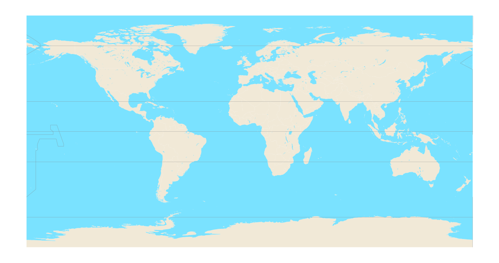

::
    
    ax = gsp.offline_static_basemap(bounds=usa.total_bounds)
    gsp.pointplot(usa_points, ax=ax)

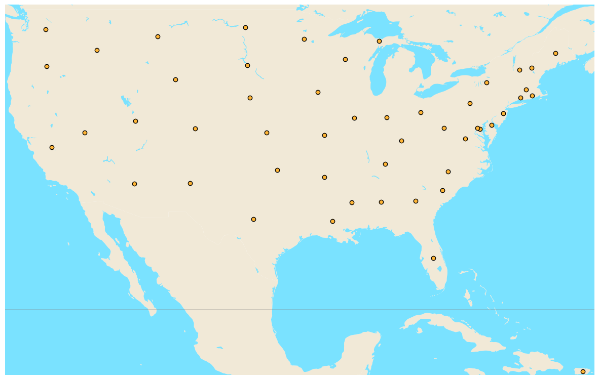

::
    
    ax = gsp.offline_static_basemap(
        bounds=usa.total_bounds,
        landcolor="#DCE1B5",
        watercolor="#68BCFF",
        gridlines_alpha=0,
        linewidth=0.5,
    )
    gsp.pointplot(usa_points, ax=ax)

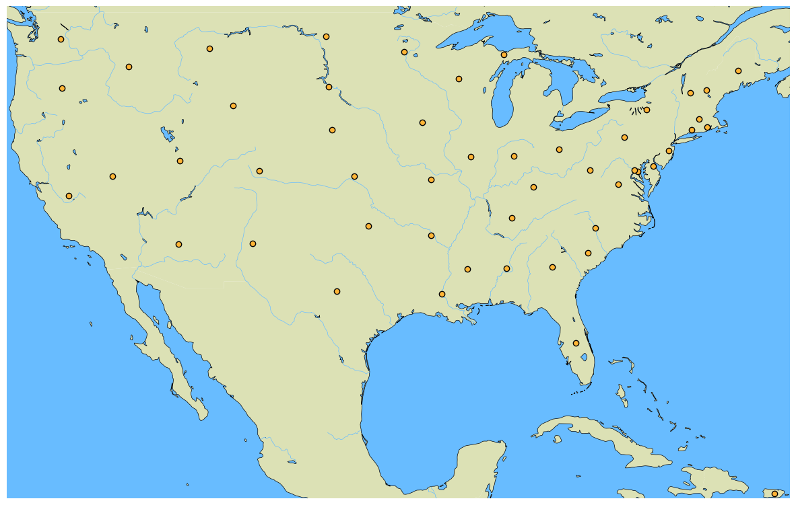

.. py:function:: offline_folium_basemap(    location=[0, 0],    landcolor="#f1e9d7",    watercolor="#32d2ff",    gridlinescolor="grey",    gridlines_opacity=0.5,    gridlines_weight=0.5,    dash_array="5, 5",    edgecolor="black",    borders=0,    linewidth=0.5,    zoom_start=2,    max_zoom=5,    style_function=None,    \*\*folium_kwds,)

    Generates a interactive folium basemap that can be used as base for other plots.
    This function can be used without internet as the map is generated using naturalearth vector data.

    :param location: Location to center the basemap. Defaults to [0, 0].
    :type location: list
    :param landcolor: Color of land. Defaults to "#f1e9d7".
    :type landcolor: str
    :param watercolor: Color of water. Defaults to "#32d2ff".
    :type watercolor: str
    :param gridlinescolor: Color of gridlines. Defaults to "grey".
    :type gridlinescolor: str
    :param gridlines_opacity: Opacity of gridlines. Defaults to 0.5.
    :type gridlines_opacity: float
    :param gridlines_weight: Linewidth of gridlines. Defaults to 0.5.
    :type gridlines_weight: float
    :param dash_array: Dash array parameter of folium map. Defaults to "5, 5".
    :type dash_array: str
    :param edgecolor: Color of edges. Defaults to "black".
    :type edgecolor: str
    :param borders: Line width of borders. Defaults to 0.
    :type borders: int
    :param linewidth: Linewidth of shapes. Defaults to 0.5.
    :type linewidth: float
    :param zoom_start: Zoom start parameter of folium map. Defaults to 2.
    :type zoom_start: int
    :param max_zoom: Max zoom paraperter f folium map. Defaults to 5.
    :type max_zoom: int
    :param style_function: Folium style function. Defaults to None.
    :type style_function: _type_
    :param \*\*folium_kwds: Folium keywords 
    :returns: Folium map object
    :rtype: m

**Examples**
::
    
    gsp.offline_folium_basemap(crs="EPSG4326")

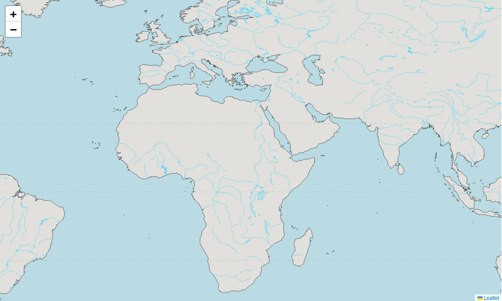
